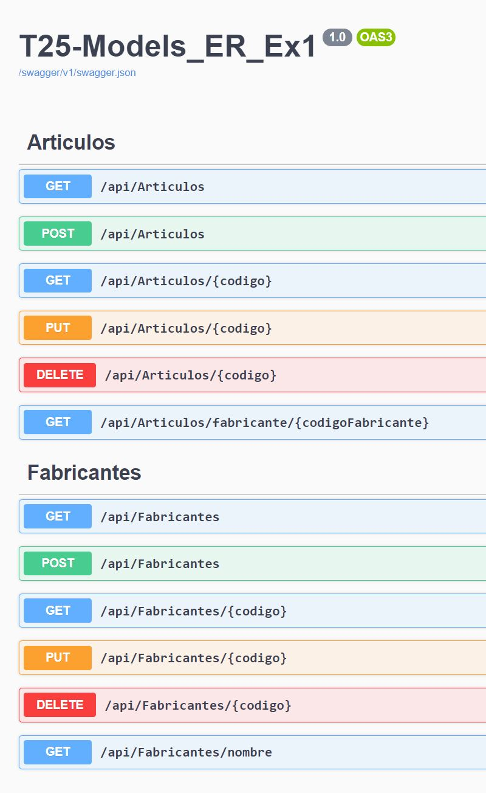

Endpoints personalizados añadidos:         
        
        /*
         * 
         * 
         * DTOs Fabricantes
         * 
         * 
         */

        // GET api/Fabricante/nombre
        // obtiene el nombre de  todos los fabricantes
        [HttpGet("nombre")]
        public IQueryable<FabricantesDto> GetFabricanteNombre()
        {
            return _context.Fabricantes.Select(AsFabricanteDto);
        }
        
        /*
         * 
         * 
         * DTOs Articulos
         * 
         * 
         */
        
        // GET api/Articulos/fabricante/{codigoFabricante}
        // obtiene todos los articulos de un fabricante mostrando nombre y precio
        [HttpGet("fabricante/{codigoFabricante}")]
        public IQueryable<ArticulosDto> GetArticulosFabricante(int codigoFabricante)
        {
            return _context.Articulos.Include(t => t.Fabricantes)
                .Where(t => t.Fabricante.Equals(codigoFabricante))
                .Select(AsArticuloDto);
        }
